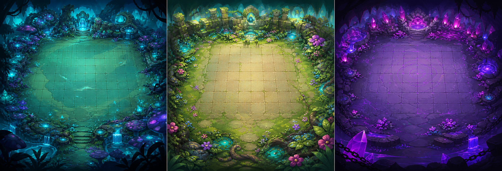
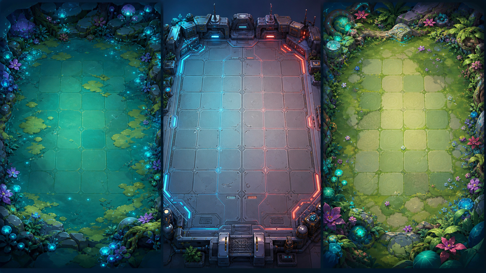
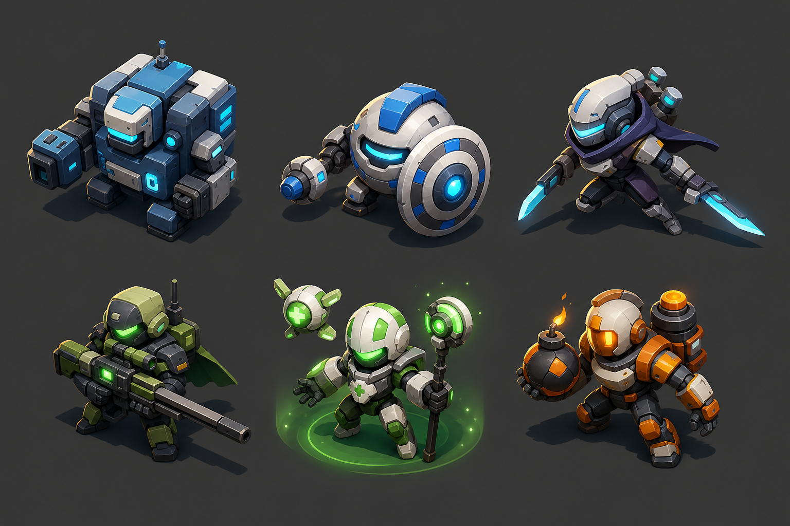
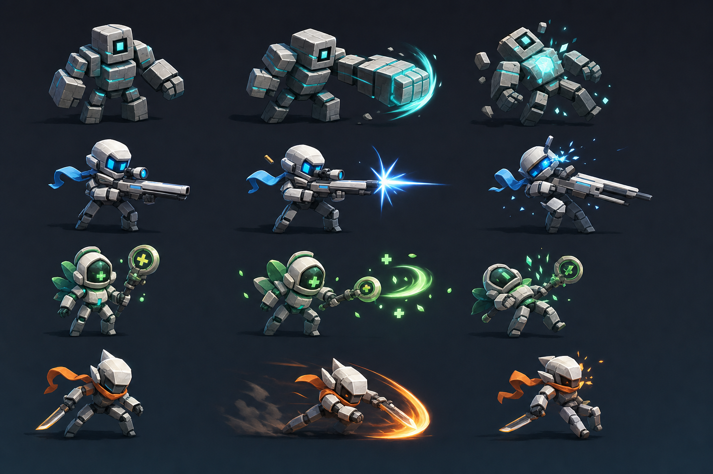

# Universe Auto Chess

Universe Auto Chess 是一款 PC / macOS 可试玩的自走棋 Roguelite 原型。玩家在一局 8 关战役中选择阵营和难度规则，消耗飞船能量部署单位，通过自动战斗、遗物、商店和路线节点逐步构筑阵容，最终挑战 Boss。



## 下载与运行

本仓库直接包含已经构建好的可运行版本，不需要安装 Unity。

### Windows

1. 克隆或下载本仓库。
2. 在 Windows 中打开仓库根目录。
3. 双击 `AutoChess.exe`。
4. 保留 `AutoChess_Data/`、`MonoBleedingEdge/`、`UnityPlayer.dll` 和 `UnityCrashHandler64.exe`，它们是运行必需文件。

### macOS

1. 克隆或下载本仓库。
2. 打开 `macOS/` 目录。
3. 双击 `AutoChess_Pseudo3D_Demo.app`。

如果 macOS 因为本地安全策略拦截未签名应用，可在 Finder 中右键应用并选择“打开”，或在系统设置的安全性页面允许本应用运行。

## 核心玩法

游戏采用“地图选择 -> 战前部署 -> 自动战斗 -> 战后奖励”的循环：

```text
主菜单 -> 选择阵营 -> 选择难度修改器 -> 地图节点
-> 战前部署 -> 自动战斗 -> 战后奖励
-> 遗物 / 商店 / 精英战 / Boss 战
-> 胜利或失败结算
```

玩家的主要决策不是实时操作，而是战斗前的阵容与站位：

- 用有限能量选择要部署的单位。
- 根据敌方近战、远程、辅助和机制单位调整站位。
- 在战斗后从奖励、遗物和商店中补强构筑。
- 在难度修改器影响下权衡收益和风险。

## 视觉方向

当前版本使用伪 3D 表现：倾斜正交视角、战场底图、棋盘覆盖层、单位阴影和动作反馈共同形成可读的战斗画面。







## 兵种介绍

当前构建包含 8 个单位数据。数值来自构建所用 Unity 配置，适合用于试玩、验收和后续平衡调整。

| 兵种 | 定位 | 费用 | 生命 | 攻击 | 攻速 | 射程 | 移速 | 说明 |
|------|------|------|------|------|------|------|------|------|
| Cube | 基础前排 | 20 | 150 | 12 | 1.0 | 1.5 | 2.0 | 稳定的低费近战单位，用于承伤和占位。 |
| BigCube | 重型坦克 | 50 | 360 | 22 | 0.8 | 2.0 | 1.5 | 2x2 大体型高血量单位，适合作为精英和 Boss 核心。 |
| Round | 近战输出 | 30 | 120 | 18 | 1.2 | 1.5 | 2.5 | 兼具近战与输出属性，适合补充中前排伤害。 |
| Bomber | 机制爆破 | 25 | 140 | 15 | 1.2 | 1.5 | 2.8 | 死亡爆炸型单位，逼迫玩家分散站位。 |
| Scout | 快速突袭 | 30 | 100 | 20 | 1.5 | 1.5 | 4.5 | 高移速单位，容易冲击后排，需要前排拦截。 |
| Sniper | 长程单点 | 35 | 90 | 30 | 0.65 | 5.0 | 1.8 | 高攻击、长射程、低生命，适合作为后排威胁。 |
| Medic | 治疗辅助 | 25 | 110 | 10 | 0.9 | 2.5 | 2.0 | 支援型单位，会拉长战斗时间，通常需要优先处理。 |
| Turret | 固定炮台 | 40 | 220 | 16 | 1.5 | 5.0 | 0 | 不移动的远程火力点，适合制造后排持续压力。 |

### 敌人组合思路

- 前排压力：Cube、BigCube 用于占据战线，保护后排。
- 后排威胁：Sniper、Turret 提供长射程输出。
- 阵型考验：Bomber 惩罚扎堆站位。
- 后排切入：Scout 用高速移动突破薄弱防线。
- 持续作战：Medic 治疗核心单位，要求玩家改变击杀优先级。

## 地图池与节点池

当前版本使用 `默认星图`，由 8 层节点构成。地图池不是完全随机的大地图，而是一条用于验证 Roguelite 节奏的样板路线；每层节点代表一个战役阶段。

| 层数 | 节点类型 | 当前关卡 | 玩法目的 |
|------|----------|----------|----------|
| 1 | 普通战 | 基础近战 | 教玩家完成部署和自动战斗。 |
| 2 | 普通战 | 近战 + 远程 | 引入 Sniper，让玩家理解前后排保护。 |
| 3 | 遗物节点 | 三选一构筑 | 无战斗，选择遗物确定强化方向。 |
| 4 | 精英战 | 肉盾 + 辅助 | BigCube + Medic，考验集火和击杀顺序。 |
| 5 | 商店 | 补充资源 | 消耗飞船能量购买单位、遗物或升级。 |
| 6 | 普通战 | 自爆 + 冲锋 | Bomber + Scout，考验分散站位和后排保护。 |
| 7 | 精英战 | Boss 机制预演 | BigCube + Turret，模拟坦克加远程火力。 |
| 8 | Boss 战 | 巨型 Boss + 召唤物 | BigCube + Bomber，半血狂暴，完成最终检验。 |

### 节点类型说明

- 普通战：提供基础战斗奖励，是阵容成长的主要来源。
- 精英战：敌人组合更强，奖励价值更高，用于检验阵容质量。
- 遗物节点：从多个被动效果中选择一个，改变本局构筑方向。
- 商店节点：用能量购买补强内容，修正阵容短板。
- Boss 战：最终压力点，验证整局资源管理、站位和遗物选择。

## 遗物池

当前构建包含 15 个遗物，主要覆盖属性成长、资源收益、防御、生存和特殊机制：

| 遗物 | 效果 |
|------|------|
| 装甲板 | 所有单位最大生命值 +25%。 |
| 战斗芯片 | 所有单位攻击力 +20%。 |
| 战斗刺激剂 | 攻击力 +10%，攻击速度 +15%。 |
| 晶体护盾 | 生命值 +15%，固定伤害减免 +5。 |
| 击杀开关 | 每次击杀敌人获得额外飞船能量。 |
| 神经加速 | 所有单位攻击速度 +25%。 |
| 超载斗篷 | 攻击力大幅提升，但最大生命值降低。 |
| 过载核心 | 友方死亡时对周围敌人造成爆炸伤害。 |
| 能量电池 | 每回合额外获得飞船能量。 |
| 修复无人机 | 每场战斗开始时恢复全体单位生命。 |
| 护盾矩阵 | 每个单位获得固定伤害减免。 |
| 战术扫描仪 | 攻击力提升，并在击杀时获得能量。 |
| 复仇协议 | 友方死亡时，存活友军永久增加攻击。 |
| 领主徽章 | 击败精英和 Boss 时获得额外能量奖励。 |
| 传送阵 | 战斗开始时随机传送一个敌人到己方阵营。 |

## 难度修改器

开局可选择不同修改器改变整局规则：

| 修改器 | 规则 |
|--------|------|
| 标准探索 | 常规难度，无特殊规则，适合第一次试玩。 |
| 钢铁洪流 | 敌人生命提升，战斗奖励能量也提升。 |
| 精英小队 | 初始部署上限提升，玩家单位攻击力翻倍。 |
| 遗物猎手 | 遗物节点和商店提供更多遗物选择。 |
| 杀戮狂潮 | 敌人生命和攻击提高，击杀获得额外能量。 |
| 绝境求生 | 受伤惩罚翻倍，但战斗奖励能量翻倍。 |

## 操作说明

- 鼠标左键：选择单位、点击按钮、放置或确认操作。
- 鼠标点击棋盘格：在部署阶段放置单位或查看反馈。
- 开始战斗：部署完成后进入自动战斗。
- 地图、奖励、商店和结算界面：通过按钮继续推进流程。

开发测试版本内置调试面板：

- 按键盘左上角反引号键 ` 打开或关闭调试面板。
- 可用于跳关、增加能量、强制胜利、强制失败、打开地图和随机遗物。
- 该面板主要用于验收、调试和快速查看关卡内容。

## 仓库文件说明

```text
AutoChess.exe                         Windows 启动程序
AutoChess_Data/                       Windows Unity 游戏数据
MonoBleedingEdge/                     Windows Unity Mono 运行时
UnityPlayer.dll                       Windows Unity 播放器运行库
UnityCrashHandler64.exe               Windows 崩溃处理程序
macOS/AutoChess_Pseudo3D_Demo.app/    macOS 应用包
docs/images/                          README 展示图片
README.md                             游戏介绍与运行说明
```

## 版本状态

这是一个可试玩原型，重点展示核心玩法闭环、8 关战役节奏、兵种组合、地图节点、遗物构筑、商店补强和伪 3D 视觉方向。它不是最终商业发行版本，后续仍可继续扩展正式美术、音频、更多单位、更多地图池、更多关卡和完整数值平衡。

## 开发信息

- 引擎：Unity 2022.3 LTS
- 渲染管线：Built-in Render Pipeline
- 平台：Windows / macOS
- 当前仓库内容：已构建可运行版本

